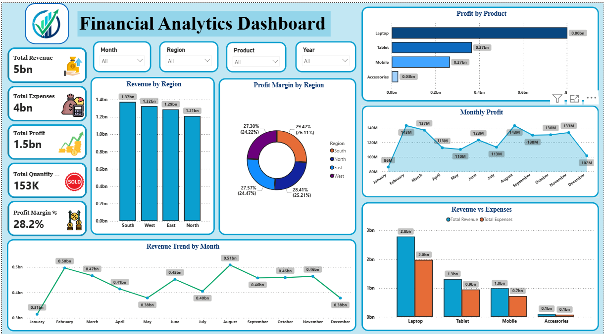

# 💰 Financial Analytics Dashboard

## 📖 Project Overview

The Financial Analytics Dashboard is an interactive Power BI project designed to analyze a company's financial performance. It provides a comprehensive overview of revenue, expenses, profit, profit margin, and product performance through dynamic visualizations and KPI cards.

This dashboard helps business stakeholders monitor financial health, identify high-performing products and regions, and make data-driven decisions.

---

## 🎯 Business Problem

Organizations need a clear understanding of their financial performance to improve profitability and optimize business operations.

This dashboard answers key business questions such as:

- What is the total revenue, expenses, and profit?
- Which region generates the highest revenue?
- Which product contributes the most profit?
- How does revenue change over time?
- What is the profit margin across different regions?

---

## 📊 Dashboard Features

- KPI Cards for Revenue, Expenses, Profit, Quantity Sold, and Profit Margin
- Revenue Trend by Month
- Revenue by Region
- Profit by Product
- Revenue vs Expenses Comparison
- Monthly Profit Analysis
- Profit Margin by Region
- Interactive Slicers (Month, Region, Product, Year)

---

## 📈 Key Performance Indicators (KPIs)

- 💰 Total Revenue
- 💸 Total Expenses
- 📈 Total Profit
- 📦 Total Quantity Sold
- 📊 Profit Margin %

---

## 📌 Dashboard Preview



---

## 💡 Key Insights

- Revenue exceeded **5 Billion**, indicating strong business performance.
- Overall profit margin is approximately **28%**.
- Laptop products generate the highest profit.
- South region contributes the highest revenue.
- Monthly revenue trends highlight seasonal fluctuations.
- Accessories contribute the least profit among all product categories.

---

## 🛠️ Tools & Technologies

- Power BI Desktop
- Microsoft Excel
- DAX (Data Analysis Expressions)
- Power Query
- Data Modeling

---

## 📂 Dataset

The dataset contains **1,000 financial records** with the following fields:

- Date
- Month
- Region
- Product
- Quantity Sold
- Revenue
- Expenses
- Profit

Supporting tables:

- Region
- Product

---

## 📁 Project Structure

```
Financial-Analytics-Dashboard/
│
├── Financial Analytics Dashboard.pbix
├── Financial_Analytics_Dataset_1000Rows.xlsx
├── Financial Analytics Dashboard.png
└── README.md
```

---

## 🚀 Skills Demonstrated

- Data Cleaning
- Data Modeling
- DAX Measures
- Financial KPI Analysis
- Interactive Dashboard Design
- Business Intelligence Reporting
- Data Visualization

---

## Author

**Thanushree J**


---

## ⭐ If you found this project useful, consider giving it a star!
